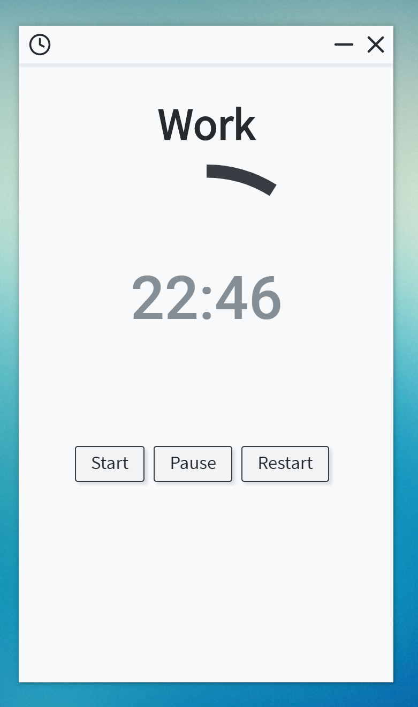

# sigag

sigag (시각) - Korean for "time"

Study efficiently with an interval timer and track studying habbits using Sigag. Study in 25 minute to 5 minute intervals or study in custom intervals. ~~Track how often you study, and other useful statistics in the statistics page. Sigag will be a free desktop program available for everyone to use.~~

</img>

## Archived

This project is archived. I have no intentions of revisiting this project. There are no distribution or installation files for this project. I strongly do not recommend using this project for any serious work.

## Features

* [x] Have a beautiful user interface
* [x] Set recommended intervals or create a custom interval to study at
* [x] Configure a break interval, if needed
* [x] Works in the basic form
* [ ] ~~Collect various statistics such as~~
  * [ ] ~~Total work time~~
  * [ ] ~~Total break time~~
  * [ ] ~~Total pauses~~
  * [ ] ~~Starting and ending time of work/break time~~
* [ ] ~~Extrapolate more statistics from the data collected above~~
* [ ] ~~Beautifully graph collected ad extrapolated data over any time interval~~
  * [ ] ~~Weekly, week to-date, monthly, month to-date, etc.~~

## Usage

```bash
$ git clone https://github.com/eankeen/sigag
$ cd sigag
$ npm install
$ npm start
```
